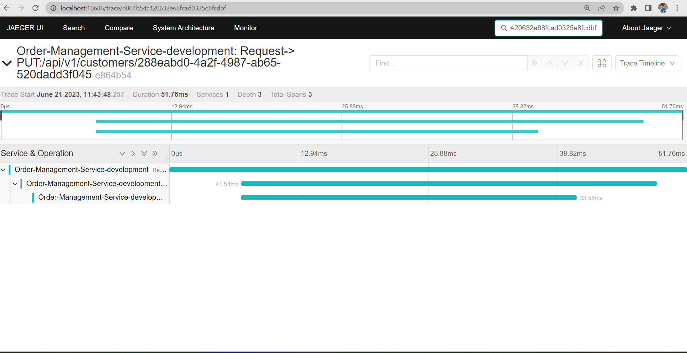

# Jaeger

## Overview
* Jaeger is a distributed tracing system released as open source by Uber Technologies.
* It is used for monitoring and troubleshooting microservices-based distributed systems, including:
   - Distributed context propagation
   - Distributed transaction monitoring
   - Root cause analysis
   - Service dependency analysis
   - Performance / latency optimization

* As in most distributed tracing systems, Jaeger works with spans and traces, as defined in the OpenTracing specification.
    - span: It is an action (HTTP request, call to a DB, etc) and is Jaeger’s most basic unit of work. A span must have an operation name, start time, and duration.
    - trace: It is a collection/list of spans connected in a child/parent relationship (and can also be thought of as a directed acyclic graph of spans). Traces specify how requests are propagated through our services and other components.

### Jager Architecture
* The acrchitecture of Jaeger looks like:
     

* Jaeger architecture contains following elements:
    - Jaeger client: It is the component that implements the OpenTracing API for distributed tracing.

    >**Note**: Jaeger clients are being deprecated in favor of OpenTelemetry. Again, more on that later.

    - Jaeger Agent: Jaeger agent is a network daemon that listens for spans received from the Jaeger client over UDP.

    - Jaeger Collector: The Jaeger collector receives traces from the Jaeger agent and performs validations and transformations. After that, it saves them to the selected storage backends.

    - Storage Backends: Jaeger supports various storage backends – which store the spans & traces for later retrieving them. Supported storage backends are In-Memory, Cassandra, Elasticsearch, and Kafka.

    - Jaeger Query: This is a service responsible for retrieving traces from the jaeger storage backend and making them accessible for the jaeger UI.

    - Jaeger UI: a React application that lets you visualize the traces and analyze them. Useful for debugging system issues.

    - Ingester: Ingester is relevant only if we use Kafka as a buffer between the collector and the storage backend. It is responsible for receiving data from Kafka and ingesting it into the storage backend. More info can be found in the official Jaeger Tracing docs.

## Installation and Setup
### Prerequisites
* Docker desktop installed on your system.
>**Note**: One can get docker [here](https://docs.docker.com/desktop/install/windows-install/).
* Postman installed.

### Steps for setup
* Jaeger comes with a ready-to-use all-in-one docker image that contains all the components necessary for Jaeger to run.
1. Run following command to start Jaeger container:
    ```
    docker run -d --name jaeger \
        -e COLLECTOR_ZIPKIN_HOST_PORT=:9411 \
        -e COLLECTOR_OTLP_ENABLED=true \
        -p 6831:6831/udp \
        -p 6832:6832/udp \
        -p 5778:5778 \
        -p 16686:16686 \
        -p 4317:4317 \
        -p 4318:4318 \
        -p 14250:14250 \
        -p 14268:14268 \
        -p 14269:14269 \
        -p 9411:9411 \
        jaegertracing/all-in-one:1.46

    ```
2. Once container is up, you may go to `http://localhost:16686` to access Jaeger UI.
    

3. Go to `.env` file. Add following configurations:
    ```
    TRACING_ENABLED=true
    TRACING_EXPORTER_TYPE=JaegerThrift
    TRACING_COLLECTOR_ENDPOINT=http://localhost:14268/api/traces
    JAEGER_AGENT_HOST=localhost
    JAEGER_AGENT_PORT=6831
    ```

4. Select `Run and Debug` from left side bar. And then click on `Start Debugging`.

5. Go to `Postman`. Create and send new post request to `Create customer`. You may send some more requests too.
    

6. Open Jaeger UI. Set following:
    - Under `Search` section, click on service and select `Order-Management-Service-development`.
    - Select `all` under operations tab.
    - Keep tags blank or you may give any tags you want.
    - In loopback, select time span you want to trace the requests for.
    - Keep limit results 20.
    - Click on `Find Traces`.

    You may see your traces as:
    
&nbsp;<br>
7. In Postman, Go to `Headers` tab of response. Here you may see `trace_id` and `traceparent`. You may also search traces for particular request by using this trace id given in `traceparent`.
>**Note**: The code between first `-` and second `-` in `traceparent` field is the `trace_id` of your request in `hexadecimal` form.
&nbsp;<br>

   
&nbsp;<br>

8. Copy the `trace_id` of request from `traceparent` and paste in the search box at Jaeger UI. You may see trace of that paticular request.

   


