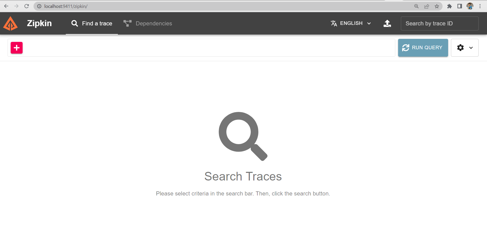
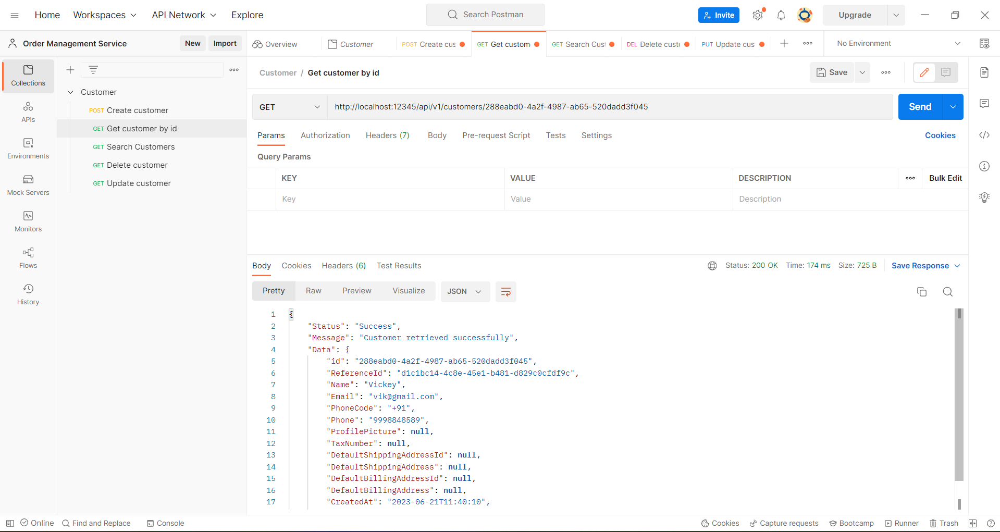
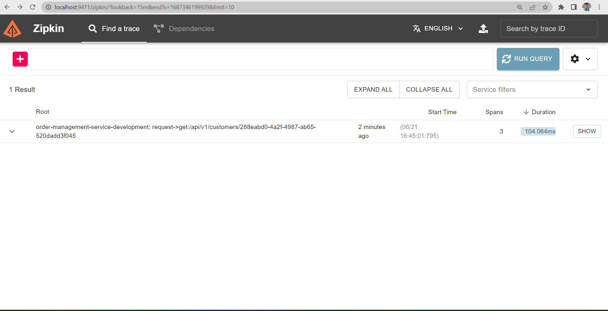
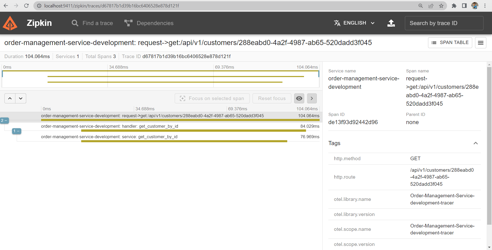

# Zipkin

## Overview
* Zipkin is a distributed tracing system.
* Zipkin helps you find out exactly where a request to the application has spent more time.

## Architecture
* Zipkin architecture contains 4 components:
    - Zipkin Collector: Once the trace data arrives at the Zipkin collector daemon, it is validated, stored, and indexed for lookups by the Zipkin collector.
    - Storage: Zipkin was initially built to store data on Cassandra. It also support ElasticSearch and MySQL.
    - Zipkin Query Service: The query daemon provides a simple JSON API for finding and retrieving traces. The primary consumer of this API is the Web UI.
    - Web UI: The web UI provides a method for viewing traces based on service, time, and annotations.

## Installation and Setup
### Prerequisites
* For this setup, one should have:
    - Docker desktop installed
    - Postman installed

### Setup
1. Run `openzipkin/zipkin` docker image to start zipkin container:
    ```
    docker run -d -p 9411:9411 openzipkin/zipkin
    ```

2. Then browse for `http://localhost:9411` and you may see the web UI of zipkin.

    
&nbsp;<br>
3. Next open `.env` file of project and add following configurations:
    ```
    TRACING_ENABLED=true
    TRACING_EXPORTER_TYPE=ZipkinJson
    TRACING_COLLECTOR_ENDPOINT=http://localhost:9411/api/v2/spans
    ```
&nbsp;<br>
4. Select `Run and Debug` from left side bar. And then click on `Start Debugging`.
&nbsp;<br>
5. Open `Postman`. Create and send new get request to `Get customer`. You may send some more requests too.
    
&nbsp;<br>
6. Open Zipkin UI and click on `Run Query`. You may see your request in the result as:
    
&nbsp;<br>
7. Then click on `SHOW` button. You may see the traces of the request.
    
